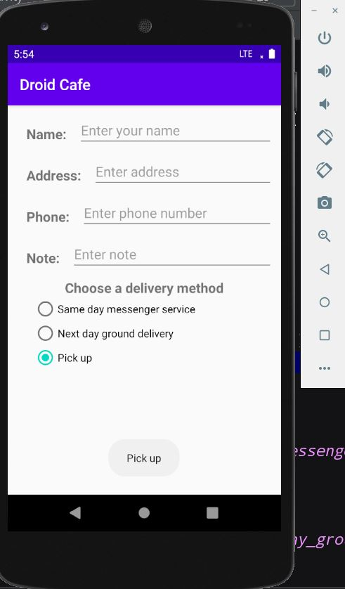

# IntelligentMobile
## Hello World Homework- Solution Code

The TwoActivities classwork app has a <b>SEND</b> button and an <b>EDIT TEXT </b>. The main of the assignment 
is to show students how to share content between two activities. In the main activity the user enters the message and clicks the SEND button. 
The information is then displayed in the Second Activity. In the Second Activity there is also a <b>REPLY</b> button and an <b>EDIT TEXT<b>.
## Pre-requisites

To execute this app you should be familiar with creating and running apps in Android Studio.

## Getting Started

Download and open the app in Android Studio.

## Result

#### Hello Constraint Homework Screenshots

