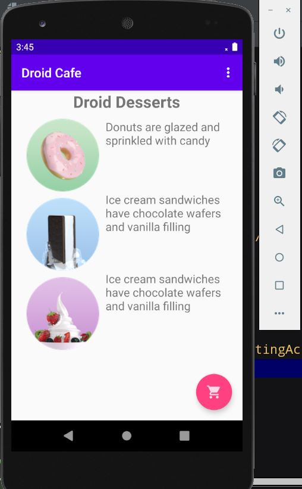

# IntelligentMobile
## Hello World Homework- Solution Code

The Hello Constraint Homework app has three buttons; the TOAST button, ZERO button, 
COUNT button, and a textview. If the toast button is clicked, it displays the hello toast message. 
The COUNT button increases the count whenever it is clicked. The ZERO resets to zero when the count is above zero. 
And it changes its color to pink when the count is above one.
## Pre-requisites

To execute this app you should be familiar with creating and running apps in Android Studio.

## Getting Started

Download and open the app in Android Studio.

## Result

#### Hello World Homework Screenshots

(pic3.JPG)
