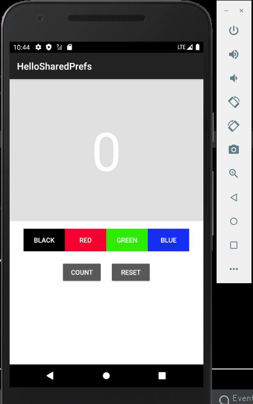
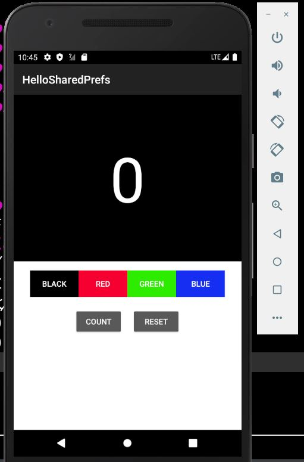
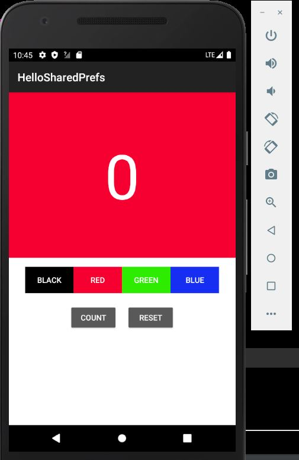
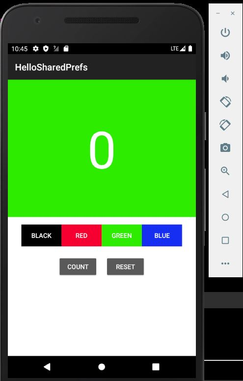

# IntelligentMobile

### Introduction

 Most schools in some parts of Africa still use the manual system of storing student information. Such an odd is not only prone to database loss, it wastes a lot of time and monetary resources. A lot of funds are spent yearly to procure books, pens and other materials. It also leads to fraud during the admission process of students into the different schools since there is no proper way of keeping and tracking student records. Therefore, it is necessary and timely to use technology to combat such occurrences into our school management systems. 

This project provides a basic platform. The features the app supports are: 

<ul>
  <li> Design app screens - Basic details of input screens - The app captures four main features of information about the student namely; student name, course name, address, and contact.</li>
 <li>Implement forms validation with required and optional fields </li>
 <li>It enables users to easily add, update, delete and read student information</li>
 <li> The app stores the students’ information based on the time in which they are added into the database </li>

 </ul>

